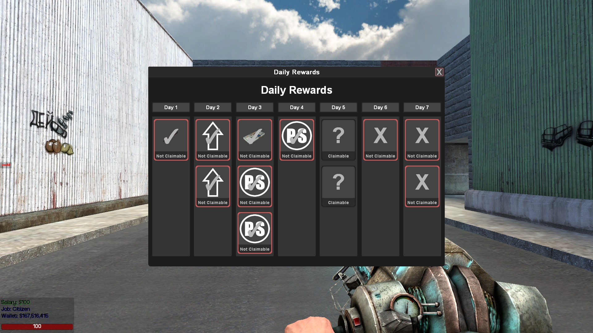

# DailyRewards

Daily Rewards are completely configurable. It is simple to add rewards and reward types. Rewards are picked randomly for each user from the list of preset rewards. Possible rewards can be configured for each day of the week, which allows different tiered rewards for specific days. Every day, up to 3 rewards can be claimed by the player. Rewards reset to day 1 once reaching the end of the week.

## Features

- Supports MySQL and SQLite
- Fully configurable
- Unlimited reward types
    - Preset rewards
        - DarkRP Cash
        - Weapons
        - Entities
        - Pointshop 1
        - Pointshop 2
        - Pointshop 2 Premium
        - [Sublime XP](https://www.gmodstore.com/market/view/sublime-levels)
        - [Sublime Level](https://www.gmodstore.com/market/view/sublime-levels)
    - Configurable reward types
        - All reward types are configurable and can be changed or added simply
- Random rewards for each player
- Supports image and model reward icons
- Supports all gamemodes
- Supports [Secondary User Groups](https://www.gmodstore.com/market/view/any-admin-mod-secondary-user-groups-easy-donation-system)

## Installation

1. Stop your server
2. Move the DailyRewards folder into your addons folder
3. Edit the config
4. Start your server

## Configuration

The config files can be found at /lua/dailyrewards/config/

Possible rewards and default settings are in config.lua

SQL database config is in sql_config.lua

Reward types can be found at /lua/dailyrewards/rewards/reward_types.lua

## Images

